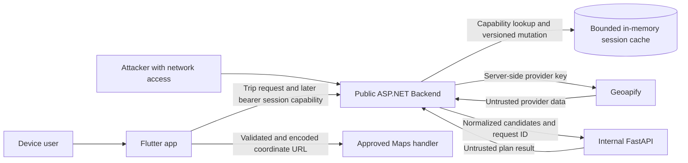

# V2 Planning Session Threat Model and Security Regression Plan

**Owner:** Sami Thaalba — Cybersecurity  
**Reviewed baseline:** `main@edd5cab05a3c4c66b2cdcb68af9ea5d5fa589750`  
**Status:** P1 pre-code threat requirements complete; implementation and RC checks pending  
**Scope:** unauthenticated bearer Planning Sessions, mutation and concurrency abuse, privacy, provider/session leakage regressions, and external Maps safety  
**Not a full penetration test:** this document defines security requirements and the evidence needed for later verification. It does not add authentication, JWT, distributed storage, or product behavior.

## 1. Overview

The current release has a native Flutter client that calls only the public ASP.NET Backend. The Backend validates a trip-preview request, gets candidate places from an explicit fixture or Geoapify source, calls the internal FastAPI planner, validates the planning result, and returns a rendered plan. Flutter's real client is constructed with only the Backend URL and posts to `/trip-plans/preview` (`mobile/lib/services/trip_api_factory.dart:5-10`, `mobile/lib/services/backend_trip_api.dart:15-30`). The Backend route, service call, provider selection, and two outbound clients are visible at `Backend/TripPlanning.Api/Controllers/TripPlansController.cs:8-43` and `Backend/TripPlanning.Api/Program.cs:25-94`.

V2 will add an unauthenticated Planning Session. The session ID is a **bearer capability**: possession grants access to that session. This does not require login, JWT, a database, or Redis. It does require an unguessable token, strict session isolation, bounded state and lifetime, safe mutation concurrency, and strong redaction because a leaked token is equivalent to leaked authority.

At the reviewed baseline, there is no Planning Session type, endpoint, cache, versioned mutation contract, or lock implementation in Backend or Flutter. Flutter also has no Maps-launching dependency or URL-opening code (`mobile/pubspec.yaml:30-50`). The current public place response does not include coordinates (`Backend/TripPlanning.Api/DTOs/Responses/PlaceResponse.cs:3-16`). Consequently, all session runtime properties and Maps behavior below are requirements or planned checks, not verified findings.

### Components and evidence

| Component | Current or planned responsibility | Source or status |
| --- | --- | --- |
| Flutter | Sends user choices to ASP.NET and renders plans; later holds the bearer session capability and opens a Maps URL. | Current Backend-only client: `mobile/lib/services/backend_trip_api.dart:15-44`; Maps implementation absent at this SHA. |
| ASP.NET Backend | Public trust boundary; validates requests, owns session creation/mutation, cache, version checks, cleanup, redaction, and safe errors. | Current preview entry point: `Backend/TripPlanning.Api/Controllers/TripPlansController.cs:8-43`; session implementation absent. |
| Session store and per-session concurrency control | Planned in-process capability-indexed state with absolute expiry and bounded cleanup. | User-supplied V2 design context; implementation and exact expiry are pending owner work/P0 decisions. |
| Geoapify | External untrusted provider; returns names, categories, IDs, and coordinates. | Server-side key and query construction: `Backend/TripPlanning.Api/Services/Classes/GeoapifyClient.cs:23-65`; normalization: `Backend/TripPlanning.Api/Services/Classes/GeoapifyCandidateSource.cs:28-124`. |
| FastAPI planner | Internal service receives normalized candidates and returns a plan. | Backend call and request-ID propagation: `Backend/TripPlanning.Api/Services/Classes/FastApiPlanningClient.cs:27-84`. |
| External Maps handler | Planned OS/browser handoff using validated coordinates only. | Package/key policy and implementation are pending Heba/P0; no current code. |

### Effective resources and configuration

| Deployment or workflow | Resource or capability | Configuration and precedence | Safe effective value or location | Readers, writers, or recipients | Enforcing control | Evidence or unknowns |
| --- | --- | --- | --- | --- | --- | --- |
| Current Flutter release | Backend destination | Compile-time `AppConfig.backendBaseUrl` | HTTPS Backend only | Flutter → ASP.NET | Factory constructs only `BackendTripApi` | `mobile/lib/config/app_config.dart:8-12`; `mobile/lib/services/trip_api_factory.dart:5-10`. |
| Current Backend | Provider credential | `GEOAPIFY_API_KEY` environment/configuration | Server-side configuration only | Backend → Geoapify | Flutter has no provider client; URI logger removed | `Backend/TripPlanning.Api/Services/Classes/GeoapifyClient.cs:23-35`; `Backend/TripPlanning.Api/Program.cs:72-94`. |
| Planned V2 | Planning Session capability | Generated once by Backend | 32 CSPRNG bytes encoded base64url; never a query parameter | Backend issues; Flutter stores in memory as needed and presents it to Backend | Backend generation plus endpoint binding | Required; transport header/path contract remains to be implemented. |
| Planned V2 | Session state | In-process bounded cache | Minimal normalized state, absolute TTL, per-entry isolation | Backend session service only | Size limits, absolute expiry, cleanup and lifecycle tests | Required; exact TTL and eviction semantics are P0 product decisions. |
| Planned V2 | Per-session lock/version | In-process synchronization | One bounded lock or atomic update per live session | Backend mutation service only | Compare-and-swap/version check; cleanup with session | Required; implementation absent. |
| Planned V2 | External Maps target | Approved package and fixed URL template | HTTPS Maps origin with encoded numeric coordinates only | Flutter → OS/browser Maps handler | Coordinate validation, fixed origin, safe failure path | Pending Heba's package choice and P0 key/license policy. |

## 2. Threat Model, Trust Boundaries, and Assumptions

### Protected assets and security objectives

1. **Session capability confidentiality.** A raw session token must not appear in standard logs, exception text, response diagnostics, screenshots, committed fixtures, analytics, URLs, or evidence. If correlation is needed, use a nonreversible short fingerprint that cannot be used as the capability.
2. **Session integrity and isolation.** A capability may access only its matching entry. Action payloads must never select another session, place, day, or version outside the server-side session state.
3. **Mutation correctness.** The client supplies the expected version and the Backend commits only if it still matches. For two concurrent same-version mutations, exactly one may commit; the other receives a controlled conflict without overwriting the winner.
4. **Capability strength.** Generate each ID from 32 bytes using a cryptographic random generator and encode it as unpadded base64url. IDs must be nonsequential and independent of user input, time, request IDs, or process counters. This provides 256 bits of entropy before encoding.
5. **Bounded lifetime and resources.** Use an absolute lifetime, bounded body/list/string/action limits, bounded cache capacity, and bounded per-session synchronization. Expired and evicted entries and their locks must be cleaned up. Invalid work must be rejected before provider or planner calls.
6. **Privacy-minimal storage.** Cache only normalized state required to display and mutate the plan. Do not cache raw provider responses, provider URLs, raw request bodies, secrets, or unnecessary personal data.
7. **Safe responses.** Session responses must use `Cache-Control: no-store`; public errors must omit stack traces, raw tokens, provider URLs, secrets, and internal object details.
8. **Untrusted-data handling.** Provider names and other text are display data, not code or URL authority. Backend and Flutter must enforce types and bounds; Flutter must render text without interpreting it as markup or a destination URL.
9. **External Maps safety.** Accept only finite numeric latitude in `[-90, 90]` and longitude in `[-180, 180]`; build the URL from a fixed approved HTTPS origin/template; encode query values; include no session/provider token or analytics payload; handle a missing launcher safely.
10. **No auth expansion.** Bearer capability controls apply only to the individual planning session. This threat model does not introduce accounts, JWT, general authorization, persistent identity, DB, or Redis.

### Actors and attacker capabilities

| Actor | Realistic starting capability | Does not initially have | Capability gained if a control fails |
| --- | --- | --- | --- |
| Remote unauthenticated client | Can call public Backend endpoints repeatedly, send arbitrary JSON/headers/IDs, replay requests, race requests, and disconnect during work. | A valid random session capability or server configuration access. | Read or mutate another session; exhaust memory/CPU/provider budget; overwrite concurrent work; learn existence/lifetime. |
| Holder of a legitimately issued token | Can read/mutate that one session according to the contract. | Authority over other sessions or server internals. | Cross-session access if payload targets are trusted or cache keys are confused. |
| Malicious or compromised provider response | Can control provider-returned text, IDs, lengths, categories, coordinates, and malformed structures. | Backend configuration or Flutter code execution. | Log/UI injection, unsafe external URL, resource consumption, or corrupted cached state if data is not normalized. |
| Curious operator/log reader | Can see ordinary service logs and operational evidence. | A live bearer capability or provider key. | Session takeover or provider abuse if raw secrets/capabilities are logged. |
| Flutter app/user | Can request a Maps handoff for a rendered place. | Authority to choose arbitrary URL schemes/origins through provider text. | Launch an attacker-controlled URL or leak a capability if the URL is assembled unsafely. |

### Trust boundaries and required controls

| Boundary | Data or authority transferred | Must controls | Should controls | Verification owner |
| --- | --- | --- | --- | --- |
| Flutter → Backend session API | Bearer token, expected version, action union and user-controlled values | HTTPS; token outside query string; strict token syntax/length; strict JSON discriminated union; reject unknown/extra fields; validate all targets against server session; body/list/string/day/action bounds; `no-store`; controlled 400/413/conflict/not-found responses. | Uniform external handling where P0 permits; request ID separate from session ID; cancellation propagated. | Mohammad implements; Sami tests. |
| Backend → session cache | Capability grants lookup/mutation authority | 32 CSPRNG bytes/base64url; exact-key isolated lookup; minimal normalized state; absolute TTL; bounded entries; atomic version check; exactly one concurrent commit; cleanup cache and lock together. | Avoid copying raw token; instrument counts without IDs; deterministic cleanup tests with injectable clock. | Mohammad implements; Sami tests. |
| Backend → Geoapify | Server credential and bounded request; untrusted response returns | Key server-side only; fixed/allowlisted HTTPS host; timeout; request/results bounded; normalize fields; validate finite/ranged coordinates; no raw URI/key logging. | Add response byte cap and local feature/candidate cap; correlate with safe request ID. | Mohammad implements; Sami regression-tests. |
| Backend → FastAPI | Normalized candidates and request ID | Timeout/cancellation; bounded schema; validate returned plan semantically; controlled errors; no full payload logging. | Reject oversized planner response independently. | Mohammad/AI owner implement; Sami regression-tests. |
| Backend → logs/evidence | Diagnostics and test evidence | No raw session capability, provider key, raw request/response body, sensitive provider URL, or stack trace in public evidence. | Log event, outcome, request ID, safe counters and token fingerprint only if operationally necessary. | All owners; Sami verifies. |
| Backend → Flutter response | Session capability/state, version, plan and errors | `Cache-Control: no-store`; bounded response; no internal/provider fields; safe error envelope. | `Pragma: no-cache` for older intermediaries if required by deployment. | Mohammad implements; Sami/Heba verify. |
| Flutter → external Maps | Coordinates and optional safe label | Fixed approved HTTPS URL/scheme; finite/ranged numeric coordinates; encode values; no secret/session/provider token/analytics; safe missing-handler result. | User-visible confirmation only if product requires; package/license/key policy documented. | Heba implements; P0 decides package/key policy; Sami verifies. |

### Assumptions, exclusions, and open decisions

- The Backend endpoint is publicly callable and there is intentionally no user authentication. Possession of a session ID is the only planned session authority.
- Session storage is planned as local in-process state for this iteration. Restart behavior, exact absolute expiry, eviction user experience, conflict payload detail, and enumeration trade-offs are P0/product decisions. This review specifies security properties but does not choose those semantics.
- A fixed absolute expiry is required; its duration is unresolved. Sliding renewal must not be introduced accidentally.
- The Maps package, license/key policy, and user-facing Maps behavior are pending Heba/P0. No package has been approved by this review.
- Distributed consistency, persistence, multi-instance routing, accounts, authorization roles, JWT, DB/Redis, UI design, destination expansion, and QA's independent RC verdict are out of scope.
- Current request validation bounds `days` but does not bound the interest list or string lengths (`Backend/TripPlanning.Api/Validators/TripPlanPreviewRequestValidator.cs:12-34`). V2 session endpoints must not inherit that gap.
- Current request-ID middleware accepts any nonblank caller value without syntax/length normalization (`Backend/TripPlanning.Api/Middleware/RequestIdMiddleware.cs:14-27`). Session logs must not reuse or derive request IDs from the bearer token, and the existing request-ID hardening remains a separate Medium follow-up.

## 3. Attack Surface, Mitigations, and Attacker Stories

The scenarios below are threat hypotheses and test requirements until implementation exists. They are not claims that the absent V2 code is vulnerable.

| Priority | Scenario and capability gain | Prerequisites | Impact | Existing controls | Required mitigation | Evidence/status |
| --- | --- | --- | --- | --- | --- | --- |
| Must | Guess or enumerate session IDs to read/mutate another plan. | Public session endpoint and weak/predictable IDs or distinguishable enumeration behavior. | Cross-session confidentiality/integrity loss. | No session code yet. | 32 CSPRNG bytes, unpadded base64url, strict parser, user-independent generation; assess response-enumeration semantics after P0 decision. | Pending P3 source and statistical format checks. |
| Must | Token leaks through URL, logs, exception, screenshot, fixture, analytics, or evidence and becomes reusable. | Token placed in query string or logged as ordinary data. | Session takeover for token lifetime. | Current provider client suppresses built-in URI logging (`Backend/TripPlanning.Api/Program.cs:72-94`); no session control exists. | Never put token in a URL; central redaction; no raw body logging; sanitized tests/evidence; repository/history scan. | Pending implementation and P9 scan. |
| Must | Replay a stale mutation after a newer plan version and overwrite current state. | Mutation lacks expected-version compare-and-swap. | Integrity loss and confusing user-visible state. | No session implementation. | Require expected version on every mutation and atomically reject stale versions without modifying state. | Pending P3/P4 test. |
| Must | Two same-version mutations race and both commit. | Check and write are separate or lock is ineffective. | Lost update; non-deterministic state corruption. | No session implementation. | Per-session atomic critical section or compare-and-swap; exactly one commit; release lock on cancellation/error. | Pending deterministic concurrency test. |
| Must | Action-union confusion, extra fields, duplicate JSON properties, or cross-session targets select unintended behavior/state. | Permissive polymorphic deserialization or trusting client-selected targets. | Unauthorized mutation or invariant bypass. | Current endpoint uses simple DTOs only. | Strict discriminator and per-action schema; reject unknown/extra/ambiguous fields; validate place/day/action against the looked-up session. | Pending malformed contract tests. |
| Must | Oversized body/list/string/action creates expensive parse, cache, provider, planner, or lock work. | Missing transport/application bounds or late validation. | Memory/CPU/provider exhaustion. | Current days bound exists; list/string/body session bounds do not (`Backend/TripPlanning.Api/Validators/TripPlanPreviewRequestValidator.cs:20-34`). | Enforce transport body cap and small per-field/list/action limits before dependency calls; return controlled 400/413; cap response and cached state. | Pending P4 boundary tests; exact safe values set with Backend owner. |
| Must | Random IDs create cache/lock growth; expired entries or locks remain after TTL, eviction, cancellation, or error. | Unbounded dictionary, per-ID lock creation before valid lookup, or separate cleanup paths. | Sustained memory exhaustion. | No session cache. | Allocate locks only after validated live lookup; bound total entries; absolute TTL; atomic removal of state and lock; periodic/on-access cleanup; restart behavior documented. | Pending clock-driven growth/cleanup tests. |
| Must | Provider text or malformed data is cached/rendered or used as a URL. | Provider controls name/ID/coordinate fields. | UI/log injection, unsafe navigation, cache bloat. | Backend currently selects named fields and validates coordinates (`Backend/TripPlanning.Api/Services/Classes/GeoapifyCandidateSource.cs:42-124`, `Backend/TripPlanning.Api/Services/Classes/GeoapifyCandidateSource.cs:179-220`). | Enforce string/collection limits and numeric coordinates before cache; render provider text as text; Maps URL uses only validated coordinates and fixed origin. | Existing coordinate normalization partially covers this; malicious-text regression pending. |
| Must | Maps handoff launches an attacker-chosen scheme/host or leaks session/provider data. | URL assembled from provider URL/text or includes token/key. | External navigation abuse or credential/session disclosure. | No Maps code/package at baseline. | Approved package; fixed HTTPS origin/template; encoded numeric query; no capability/key/analytics; safe missing-handler behavior. | Blocked by Heba/P0 decision and implementation. |
| Must | Error paths expose stack traces, raw token, raw provider URL/key, or cached state. | Default exception output or logging exception objects that contain URI/body. | Secret/capability disclosure and reconnaissance. | Current planning middleware emits fixed messages for known failures (`Backend/TripPlanning.Api/Middleware/PlanningExceptionMiddleware.cs:16-54`). | Map all session/provider/planner failures to controlled envelopes; sanitize logs; test malformed, timeout, cancellation and malicious provider inputs. | Current non-session control exists; V2 regression pending. |
| Should | Same token receives cacheable responses from device/intermediary. | Missing cache headers. | Session data retained or disclosed after use. | Current preview does not set no-store. | Set and test `Cache-Control: no-store` on all session success and error responses. | Pending implementation. |
| Should | Client disconnect/cancellation leaves provider/planner work or per-session lock active. | Cancellation not propagated or lock released incorrectly. | Resource exhaustion and blocked sessions. | Current preview forwards cancellation through the service and clients (`Backend/TripPlanning.Api/Controllers/TripPlansController.cs:30-41`; `Backend/TripPlanning.Api/Services/Classes/GeoapifyClient.cs:61-82`). | Preserve propagation across session mutations; release synchronization in `finally`; verify no commit after cancellation. | Regression pending. |

### Targeted implementation and regression checks

| Check | Safe test method | Required result | Evidence to retain |
| --- | --- | --- | --- |
| Entropy/format | Create many sessions locally; decode every token; check uniqueness, decoded length and allowed base64url alphabet. Do not save raw tokens. | Every token decodes to 32 bytes; no duplicates; no sequential/user-derived structure. | SHA, test name/tool version and aggregate counts only. |
| Isolation/enumeration | Use redacted valid, altered, long, malformed and random IDs; attempt cross-session targets. | No cross-session read/mutation; strict early rejection; response semantics match P0 decision. | Redacted request shapes, statuses and sanitized headers. |
| Replay/race | Mutate with stale expected version, then synchronize two same-version requests at the commit barrier. | Stale request cannot alter state; exactly one concurrent commit; final state/version equals winner. | Deterministic test output without tokens. |
| Action schema | Send missing/unknown discriminators, mixed action fields, duplicate/extra fields, wrong types and targets absent from session. | Controlled 400 before state/dependency work; no mutation. | Test names, statuses, dependency-call counters. |
| Bounds | Test just below/at/above each body, list, string, day, session and action limit using local generated data. | Accepted within policy; controlled 400/413 above it; provider/planner not called for invalid input. | Limit table and dependency-call assertions; no huge payload committed. |
| Cache/lock lifecycle | Use fake clock and bounded local workload for expiry, eviction, cancellation, exception and restart cases. | Entries and matching locks are removed; total counts remain bounded; no lock is created for arbitrary invalid IDs. | Aggregate counts before/after; exact configuration; no raw token. |
| Privacy/error regression | Capture sanitized local logs, headers, errors and fixtures for success/failure; scan diff/history for key/token patterns. | No raw token, key, raw body, sensitive provider URL or public stack trace; session responses use no-store. | Sanitized excerpts and scan reports tied to SHA. |
| Malicious provider text | Stub bounded names containing control characters, markup-like text, URL-like text and oversized values. | Reject/normalize oversized or invalid values; remaining text is rendered as text and never controls navigation/log structure. | Stub description and assertions, not raw production data. |
| Maps | Test finite/range boundaries, NaN/infinity, encoded values, malicious labels, missing handler and inspected final URL. | Only fixed approved origin/scheme and validated coordinates; no token/key; graceful false/error path. | Redacted URL structure, package/version/license/key-policy decision and test results. |
| Final RC | Re-run old provider/session leakage checks, dependency advisories, repository/history secret scan and all remediation tests on the exact RC after all merges. | Zero open Blocker/Critical; every finding marked Fixed/Verified/Open/Accepted with owner and evidence. | Exact RC SHA/environment, commands/tool versions, findings table and verdict. |

## 4. Severity Calibration

| Severity | V2 examples | Counterexamples or reducing controls |
| --- | --- | --- |
| **Critical** | Practical remote extraction of the server-side provider key or mass compromise of all live sessions with broad impact; unauthenticated remote code execution through session/provider data. | A raw token appearing only in a developer's private local test output is not automatically Critical; reachability, retention and audience determine impact. |
| **High** | Guessable session IDs enabling reliable cross-session access; race/replay that lets one client overwrite another session; public logs routinely exposing reusable live tokens; arbitrary external URL/scheme launch from provider-controlled data. | A stolen token used only for the same already-authorized session does not add cross-session authority; short absolute TTL and strict isolation reduce scope but do not excuse leakage. |
| **Medium** | Public resource exhaustion requiring sustained requests because cache/locks are not cleaned; missing body/list bounds causing avoidable provider/planner work; session responses missing no-store; detailed enumeration oracle where session contents remain protected. | Small self-only validation errors with no shared cost or new authority are Low or ordinary correctness issues. A hypothetical deployment concern without the required exposed path stays an open question. |
| **Low** | Safe operational hardening gaps such as missing non-sensitive correlation, inconsistent generic error wording, or a graceful Maps-handler message issue with no unsafe launch or data exposure. | Product wording, UI preference, planner semantics and unsupported destination choices are not security findings by themselves. |

Severity is assigned from demonstrated capability gain, affected assets, reachability, scale, lifetime, and effective controls. Missing runtime evidence affects confidence, not impact. At this baseline no V2 session or Maps vulnerability can be validated because the relevant code does not exist; the table defines how later findings will be rated.

## Gate status and ownership

| Ordered work | Status at `edd5cab` | Next evidence/owner |
| --- | --- | --- |
| P1 threat model and must/should requirements | **Complete in this document** | Review before session implementation merges. |
| P3 entropy, capability, cache, TTL, isolation and privacy checks | **Blocked: implementation absent** | Mohammad supplies implementation; Sami inspects and tests exact SHA. |
| Replay/race/action confusion/cross-session tests | **Blocked: implementation absent** | Sami adds targeted tests without fixing owner code. |
| Bounds, growth, cleanup, cancellation and timeout checks | **Blocked: implementation absent and exact product bounds partly undecided** | Mohammad/P0 define safe values; Sami tests locally. |
| Provider/session leakage and malicious-text regression | **Partially prepared; V2 run pending** | Sami tests after integration. |
| External Maps safety and package/key/license review | **Blocked: map choice and implementation absent** | Heba/P0 decide and implement; Sami verifies. |
| P9 scans, remediation retest and exact-RC verdict | **Blocked until final RC** | Sami records exact SHA/environment and PASS/FAIL. |

**Current verdict:** P1 security requirements are ready to precede the session merge. No claim is made that V2 sessions or Maps are secure or tested. Final sign-off requires the exact integrated RC, all applicable checks above, and zero unresolved security Blocker/Critical findings.

Repository: codex-security-target/v1:sha256:10968265d9b584363c26177e713a635d3e4fedb7d8c97838dd2cdcc6bb4de66a  
Version: edd5cab05a3c4c66b2cdcb68af9ea5d5fa589750
